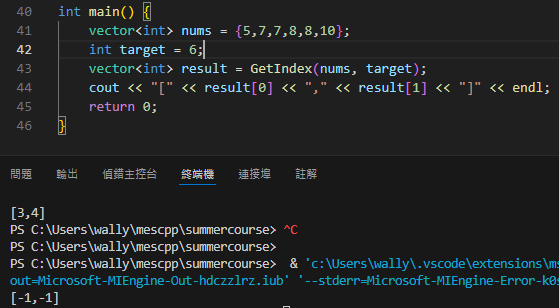
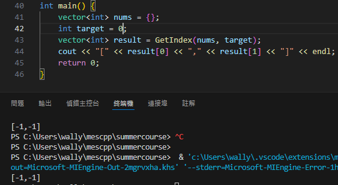

# Summer Course Homework Week 1

## Problem 1
example 1  

##
example 2  

##
example 3  

## 解釋

### 在一個已排序數列找特定數字，且時間複雜度需在Log(n)完成，可以使用Binary Search。而該題要找目標數字開始及結束的Index，因此使用兩次Binary Search分別找Index。
### 在GetIndex函式帶入整個數列及目標數字，當left flag <= right flag 就不斷進行搜尋，當兩個flag交錯就代表找到數字。第一次找最左邊的目標數字，第二次找最右邊的目標數字，回傳兩者，就會是開始及結束的index。若目標數字本來就不存在數列，由於一開始start及end初始值為-1，回傳後輸出就是[-1,-1]。

