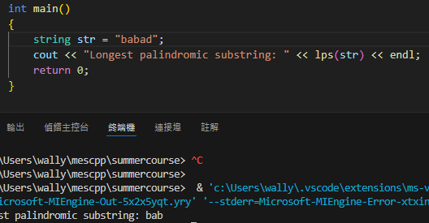
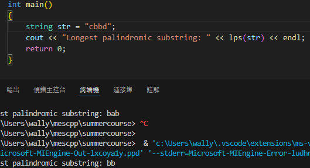

# Summer Course Homework Week 1

## Problem 2
example 1  

##
example 2  

## 解釋

### 要找the longest palindromic substring可以暴力檢查所有子字串是否為迴文，在字串很長的時候會超時，這邊使用中心擴展，把字串每個字元都當成中心，檢查左右是否相同，若不一樣就知道不是迴文，提早退出迴圈。要注意的是迴文可能是奇數字元迴文或偶數字元迴文。
### 在每一字元當中心時，分別檢查奇數或偶數字元迴文的可能性，有發現比當前紀錄迴文字串長度更長的迴文就刷新，並且紀錄該子字串的起始Index，迴圈結束後回傳的子字串就是the longest palindromic substring。

