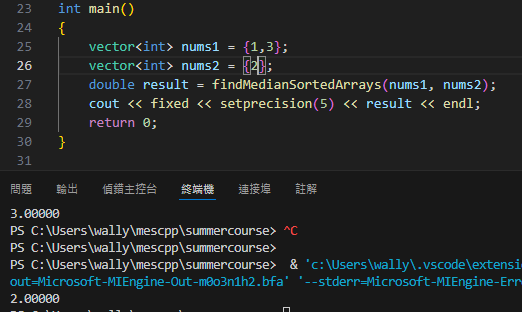

# Summer Course Homework Week 1

## Problem 3
example 1  

##
example 2  

## 解釋

### 題目要合併兩個已排序陣列後找中位數，這邊直接用使用C++ algorithm裡提供的merge()方法，此方法時間複雜度為O(m+n)，合併還是排好的陣列，直接求中位數即可。輸出需要小數點後五位，所以使用setprecision(n)。

